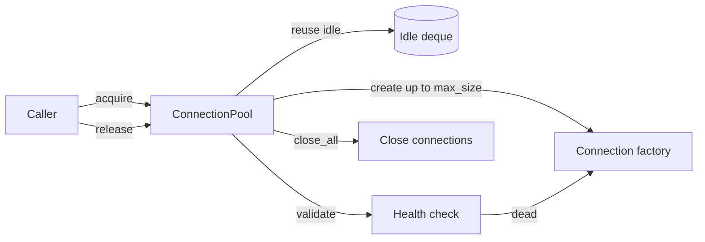

<p align="center">
  
</p>

<h1 align="center">Postgres Connection Pool</h1>

<p align="center">
  <strong>A generic, thread-safe connection pool for Python — acquire/release, max size, timeouts, and health checks.</strong><br>
  Plug in any connection factory (Postgres or otherwise), bound it, and let the pool reuse and self-heal connections.
</p>

<p align="center">
  <em>Built and maintained by <a href="https://viprasol.com">Viprasol Tech</a> — Fintech Experts. Full-Stack Builders.</em>
</p>

<p align="center">
  <a href="https://github.com/Viprasol-Tech/postgres-connection-pool/actions/workflows/ci.yml"></a>
  <a href="LICENSE"></a>
  
  <a href="https://t.me/viprasol_help"></a>
  <a href="https://github.com/Viprasol-Tech/postgres-connection-pool/stargazers"></a>
</p>

---

## ✨ Features

- 🔌 **Pluggable factory** — pass any `Callable[[], Conn]`; the pool never assumes a specific driver.
- 🧪 **Offline-testable** — a bundled `FakeConnection` lets the full test suite and demo run with no database.
- ♻️ **Connection reuse** — idle connections are handed back before new ones are created.
- 📏 **Bounded** — never exceeds `max_size`, with accurate `size` / `in_use` / `idle` stats.
- ⏱️ **Blocking acquire with timeout** — exhausted pool waits, then raises `PoolTimeoutError`.
- 🩺 **Health checks** — validate (e.g. `ping`) before handing out; dead connections are discarded and recreated.
- 🧵 **Thread-safe** — guarded by a `Condition`; releases wake blocked acquirers.
- 🖥️ **CLI** — `postgres-connection-pool demo` walks through reuse, the cap, recycling, and the context manager.
- ⚙️ **Modern tooling** — ruff, mypy (strict), pytest, GitHub Actions CI.

## 🚀 Quickstart

```bash
git clone https://github.com/Viprasol-Tech/postgres-connection-pool.git
cd postgres-connection-pool
python -m pip install -e ".[dev]"

# Run the offline demo (no database required):
postgres-connection-pool demo --max-size 2
```

## 🧩 Use it with your own connection

```python
from postgres_connection_pool import ConnectionPool, ping_healthy

# `factory` is any zero-arg callable that returns a fresh connection.
# For real Postgres: factory = lambda: psycopg.connect(DSN)
pool: ConnectionPool = ConnectionPool(
    factory=my_factory,
    max_size=10,
    timeout=5.0,            # seconds to wait when the pool is exhausted
    health_check=ping_healthy,  # discard + recreate dead connections
)

# Context manager guarantees release, even on error:
with pool.connection() as conn:
    conn.execute("SELECT 1")

print(pool.stats())  # PoolStats(size=1, in_use=0, idle=1, max_size=10)
pool.close_all()
```

## 🏗️ Architecture



## 🗺️ Roadmap

- [x] Bounded pool: acquire / release / context manager / `close_all`
- [x] Blocking acquire with timeout + `PoolTimeoutError`
- [x] Pluggable health checks with dead-connection recycling
- [ ] Optional max idle age / connection lifetime eviction
- [ ] Async (`asyncio`) pool variant
- [ ] Built-in psycopg adapter and metrics hooks

## 🤝 Contributing

PRs welcome — see [CONTRIBUTING.md](CONTRIBUTING.md) and our [Code of Conduct](CODE_OF_CONDUCT.md).

## Contact — Viprasol Tech Private Limited

- Website: [viprasol.com](https://viprasol.com)
- Email: [support@viprasol.com](mailto:support@viprasol.com)
- Telegram: [t.me/viprasol_help](https://t.me/viprasol_help) | WhatsApp: +91 96336 52112
- GitHub: [@Viprasol-Tech](https://github.com/Viprasol-Tech) | [LinkedIn](https://www.linkedin.com/in/viprasol/) | X [@viprasol](https://twitter.com/viprasol)

## License

[MIT](LICENSE) (c) 2025 Viprasol Tech Private Limited
