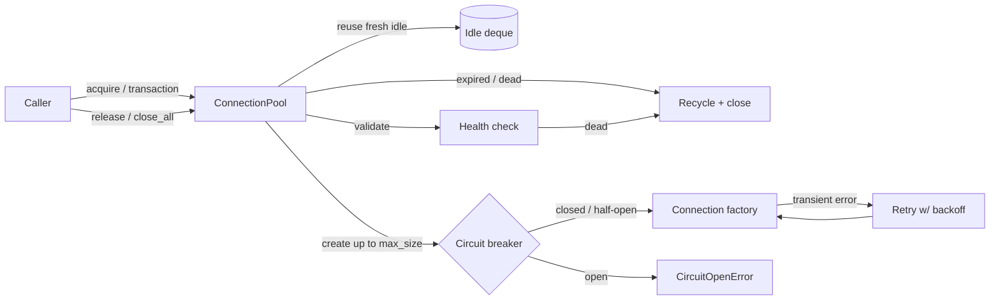

<p align="center">
  
</p>

<h1 align="center">Postgres Connection Pool</h1>

<p align="center">
  <strong>A generic, thread-safe connection pool for Python — reuse, recycling, retries, a circuit breaker, and transactions.</strong><br>
  Plug in any connection factory (Postgres or otherwise), bound it, warm it, and let the pool keep it healthy under load.
</p>

<p align="center">
  <em>Built and maintained by <a href="https://viprasol.com">Viprasol Tech</a> — Fintech Experts. Full-Stack Builders.</em>
</p>

<p align="center">
  <a href="https://github.com/Viprasol-Tech/postgres-connection-pool/actions/workflows/ci.yml"></a>
  <a href="LICENSE"></a>
  
  
  
  
  <a href="https://t.me/viprasol_help"></a>
  <a href="https://github.com/Viprasol-Tech/postgres-connection-pool/stargazers"></a>
</p>

---

## ✨ Features

- 🔌 **Pluggable factory** — pass any `Callable[[], Conn]`; the pool never assumes a specific driver.
- ♻️ **Connection reuse** — idle connections are handed back before new ones are created.
- 🔄 **Lifetime recycling** — connections older than `max_lifetime` are retired on acquire/release, defeating stale state and server idle timeouts.
- 🔥 **Warm pool** — pre-create `min_size` connections at startup and replenish the floor after a recycle.
- 🔁 **Retry-on-acquire** — transient `factory` failures are retried with optional backoff.
- 🛡️ **Circuit breaker** — fail fast with `CircuitOpenError` when the database is down, then probe recovery (half-open) before resuming.
- 💳 **Transactions** — `pool.transaction()` commits on success, rolls back on error, always releases.
- 📊 **Rich stats** — `size`, `in_use`, `idle`, plus lifetime counters: `created`, `reused`, `recycled`, `discarded_unhealthy`, `acquire_retries`, `timeouts`.
- 🩺 **Health checks** — validate (e.g. `ping`) before handing out; dead connections are discarded and recreated.
- ⏱️ **Blocking acquire with timeout** — exhausted pool waits, then raises `PoolTimeoutError`.
- 🧵 **Thread-safe** — guarded by a `Condition`; releases wake blocked acquirers.
- 🧪 **Offline-testable** — bundled `FakeConnection` / `FlakyConnectionFactory` run the full suite and demos with no database.
- 🖥️ **CLI** — `demo`, `resilience`, and `warmup` commands walk through every behaviour.

## 🚀 Quickstart

```bash
git clone https://github.com/Viprasol-Tech/postgres-connection-pool.git
cd postgres-connection-pool
python -m pip install -e ".[dev]"

# Run the offline demos (no database required):
postgres-connection-pool demo --max-size 2
postgres-connection-pool resilience
postgres-connection-pool warmup --min-size 3
```

## 🧩 Usage

### A warm, self-healing pool with a circuit breaker

```python
from postgres_connection_pool import CircuitBreaker, ConnectionPool, ping_healthy

# `my_factory` is any zero-arg callable returning a fresh connection.
# For real Postgres: my_factory = lambda: psycopg.connect(DSN)
breaker = CircuitBreaker(failure_threshold=5, reset_timeout=30.0)

pool: ConnectionPool = ConnectionPool(
    factory=my_factory,
    max_size=10,
    min_size=2,              # keep 2 connections warm (created eagerly)
    timeout=5.0,             # seconds to wait when the pool is exhausted
    health_check=ping_healthy,
    max_lifetime=300.0,      # recycle connections older than 5 minutes
    max_create_retries=3,    # retry transient connect failures
    retry_backoff=0.2,
    breaker=breaker,         # fail fast when the database is down
)

with pool.connection() as conn:
    conn.execute("SELECT 1")

print(pool.stats())  # PoolStats(size=2, in_use=0, idle=2, ..., reused=1, recycled=0, ...)
pool.close_all()
```

### Transactions

```python
# Commits on success; rolls back and re-raises on error; always releases.
with pool.transaction() as conn:
    conn.execute("INSERT INTO ledger (amount) VALUES (100)")
    conn.execute("UPDATE balances SET total = total + 100")
```

## 🏗️ Architecture



## 📚 API at a glance

| Symbol | Kind | Purpose |
| --- | --- | --- |
| `ConnectionPool(factory, ...)` | class | Bounded, thread-safe pool of reusable connections. |
| `ConnectionPool.acquire(timeout=-1.0)` | method | Check out a connection (reuse, create, or block). |
| `ConnectionPool.release(conn)` | method | Return a connection; recycles it if past `max_lifetime`. |
| `ConnectionPool.connection(timeout=-1.0)` | context mgr | Acquire for a `with` block, auto-release. |
| `ConnectionPool.transaction(...)` | context mgr | Acquire + commit/rollback as one transaction. |
| `ConnectionPool.stats()` | method | Snapshot occupancy + lifetime counters (`PoolStats`). |
| `ConnectionPool.close_all()` | method | Close all connections; idempotent. |
| `CircuitBreaker(failure_threshold, reset_timeout)` | class | Fail-fast guard around connection creation. |
| `ping_healthy` / `always_healthy` | function | Built-in health checks. |
| `PoolTimeoutError` / `PoolClosedError` / `CircuitOpenError` | exception | Pool error hierarchy (all subclass `PoolError`). |

## 🗺️ Roadmap

- [x] Bounded pool: acquire / release / context manager / `close_all`
- [x] Blocking acquire with timeout + `PoolTimeoutError`
- [x] Pluggable health checks with dead-connection recycling
- [x] Connection `max_lifetime` recycling
- [x] Warm pool (`min_size`) with replenish-on-recycle
- [x] Retry-on-acquire with backoff
- [x] Circuit breaker with half-open recovery
- [x] Context-managed transaction helper
- [ ] Async (`asyncio`) pool variant
- [ ] Built-in psycopg adapter and Prometheus metrics exporter

## ❓ FAQ

**Does this require Postgres?** No. The pool is driver-agnostic — pass any factory.
The whole suite and CLI run against an in-memory fake, so you can try it offline.

**Is it thread-safe?** Yes. All state is guarded by a `threading.Condition`; releases
wake blocked acquirers, and `stats()` returns a consistent snapshot.

**What happens when the database is down?** With a `CircuitBreaker`, `acquire()` fails
fast with `CircuitOpenError` after the failure threshold, then allows a single
half-open probe after `reset_timeout` before closing again.

**How is `max_lifetime` enforced?** Lazily — an expired connection is recycled the
next time it would be acquired or released, so there is no background thread to manage.

## 🤝 Contributing

PRs welcome — see [CONTRIBUTING.md](CONTRIBUTING.md) and our [Code of Conduct](CODE_OF_CONDUCT.md).
Run `ruff check .`, `ruff format .`, `mypy src`, and `pytest` before opening a PR.

## Contact — Viprasol Tech Private Limited

- Website: [viprasol.com](https://viprasol.com)
- Email: [support@viprasol.com](mailto:support@viprasol.com)
- Telegram: [t.me/viprasol_help](https://t.me/viprasol_help) | WhatsApp: +91 96336 52112
- GitHub: [@Viprasol-Tech](https://github.com/Viprasol-Tech) | [LinkedIn](https://www.linkedin.com/in/viprasol/) | X [@viprasol](https://twitter.com/viprasol)

## License

[MIT](LICENSE) (c) 2025 Viprasol Tech Private Limited
